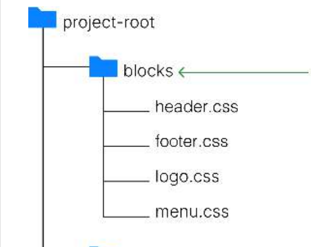
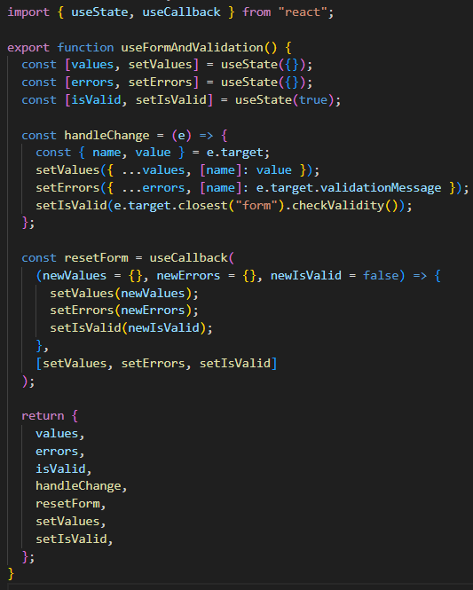
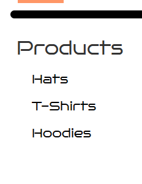
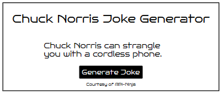
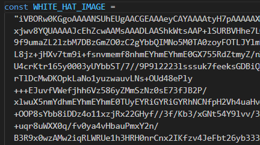

# Final Project: Merchandise Sales Site

## Site Links

Website: [Website](https://www.dmwtwr.crabdance.com/)  
API: [API](https://api.dmwtwr.crabdance.com/)

Frontend Repository: [Frontend Repo](https://github.com/DavidMiles1925/fp-frontend).  
Backend Repository: [Backend Repo](https://github.com/DavidMiles1925/fp-backend).

## Table Of Contents

**1 - Project Features**

**-- 1.1 -** Code Layout and Semantics  
-- 1.1.1 BEM Methodology  
-- 1.1.2 Naming Conventions

**-- 1.2 -** React app  
-- 1.2.1 Functional Components  
-- 1.2.2 Contexts

**-- 1.3 -** Notable Features  
-- 1.3.1 Embeded Content  
-- 1.3.2 Animations  
-- 1.3.3 Form Validation  
-- 1.3.4 Dropdown Menu  
-- 1.3.4 Chuck NorrisJoke Generator  
-- 1.3.5 Passing Images Through JSON  
-- 1.3.6 Responsive Design

**-- 1.4 -** Responsive Design  
-- 1.4.1 Flexbox  
-- 1.4.2 Grid Layout

**2 - Future Development Plans**

**-- 2.1 -** User Profile  
-- 2.1.1 Sales API  
-- 2.1.2 Order Tracker  
-- 2.1.3 Change Password

**-- 2.2 -** Physical Product Development  
-- 2.1.1 Clothing  
-- 2.1.1 Trinkets

**-- 2.3 -** Complete Documentation

**-- 2.4 -** Main Page Content

**3 - Documentation**
**-- 3.1 -** Components  
-- 3.1.1 App  
-- 3.1.2 CardSection  
-- 3.1.3 CardViewModal  
-- 3.1.4 ContactInfo  
-- 3.1.5 CreatorInfo  
-- 3.1.6 DeveloperPanel  
-- 3.1.7 DividerCard  
-- 3.1.8 Footer  
-- 3.1.9 Header  
-- 3.1.10 JokeGenerator  
-- 3.1.11 LoginModal  
-- 3.1.12 Main  
-- 3.1.13 ModalWithForm  
-- 3.1.14 ProductCard  
-- 3.1.15 ProductsPage  
-- 3.1.16 ProductViewModal  
-- 3.1.17 ProtectedRoute  
-- 3.1.18 RegisterModal  
-- 3.1.19 ShoppingCart  
-- 3.1.20 SideBarMenu  
-- 3.1.21 StillBuildingPage  
-- 3.1.22 UserDropdownMenu  
-- 3.1.23 UserInformationPage  
-- 3.1.24 UserProfilePage  
-- 3.1.25 UserSidebarMenu  
-- 3.1.26 UserUpdateProfileModal

**-- 3.2 -** Contexts  
-- 3.2.1 CurrentUserContext  
-- 3.2.2 FilterContext  
-- 3.2.3 ValidationContext

**-- 3.3 -** Utils  
-- 3.3.1 api  
-- 3.3.2 auth  
-- 3.3.3 chuckNorrisApi  
-- 3.3.4 constants  
-- 3.3.5 useFormAndValidation
-- 3.3.6 Notes on Base64 Strings as Images with JSON

**-- 3.4 -** Dependencies

## 1 - Product Features

### 1.1 - Code Layout and Semantics

**-- 1.1.1** BEM Methodology



**-- 1.1.2** Naming Conventions

Strict naming conventions were used to ensure consistency and readability, as well as to help avoid naming conflicts.

-- All variables and functions (with the exception of functional components) are `camelCase` and always start with a letter. They always begin with a letter, the first word is a noun, and they are descriptive for easy readability.

-- All functional components start with a noun. All words begin with a capital letter. Abreviations capitalize only the first letter. yes: "Url" no: "URL"

-- All named constants are `UPPERCASE` with underscores separating words. This excludes menu populator data, which follow the naming conventions for variables.

### 1.2 - React app

**-- 1.2.1** Functional Components

React allows for functions to return elements of the DOM, making easy to pair form and functionality. All functional components for this project are located in the src/components directory, and are described is section _3.1_ of the readme file.

**-- 1.2.2** Contexts

One particularly useful feature of React is the `useContext()` hook. Contexts allow for easy passing of data throughout an entire tree of elements without the need for continually passing that data through every branch of the tree. The contexts used in this project are described in section _3.2_ of the readme file.

### 1.3 - Notable Features

**-- 1.3.1** Embeded Content

Since this project is dedicated to promoting a YouTube channel, it's only natural that videos would need to be embeded. Currently, the Main Page sports the latest video from the channel.

**-- 1.3.2** Animations

To enhance the user experience, as well as avoid confusion, All buttons and links are animated. They use a pointer cursor, as well as scale up 10% when hovering the cursor over them. They also respond by scaling down when clicked, except in a few special cases.

**-- 1.3.3** Form Validation

All forms are validated before sending requests to the server. A custom hook, `useFormAndValidation`, was used for single-line impletation in each form.



**-- 1.3.4** Dropdown Menu

Menus were created to be collapsible in order to support all screen sizes.

 

**-- 1.3.4** Chuck Norris Joke Generator

One reqirement of this project was to include the use of a third-part API. The creator of the YouTube channel loves Chuck Norris jokes, so we decided a joke generator would make a good addition to the main page.



**-- 1.3.5** Passing Images Through JSON

In future versions, an admin user will be able to create new products. Connecting an image by URL is not ideal for displaying custom photos, so a user will be able to select a photo from their local machine. In order to continue using JSON format, images will be converted to base64 strings. The app has been configured to display images in a method that is consistent with receiving base64 strings as image data. Some example strings have been included in the front end image folder.



**-- 1.3.6** Responsive Design

CSS tools `flexbox` and `grid` were used ensure seamless transitions between screen sizes. In some cases, media queries were used to tweak element properties to optimize aesthetics and functionality.

## 2 - Future Development Plans

### 2.1 User Profile

**-- 2.1.1** Sales API

In order for users to actually make purchases, a sales API will be used for completing financial transations.

**-- 2.1.2** Order Tracker

Customers have come to expect updates on the status of their order. An order tracker page will need to be created in order for the user to recall their order history.

**-- 2.1.3** Change/Forgot Password

In a world of a thousand passords, it is easy to forget what one might have used as a password for one's less frequented websites. A feature to allow users to change their password will be added in the future.

### 2.2 - Physical Product Development

**-- 2.1.1** Clothing

The example items currently featured on the site are all clothing products. These will be relatively cheap and easy to obtain when our YouTube creator is really ready to take off. Shirts, hats, hoodies, etc.


**-- 2.1.2** Trinkets

Things like bumper stickers and key chains could be options in the distant future for sales and brand promotion.

### 2.3 - Complete Documentation

**-- 2.3.1** Developer Documentation (in progress, see below _section 3_)

This is currently only a small side project. Later on, if this endevour is scaled up, it will be important for myself (or potentially other developers) to have notes about the code.

**-- 2.3.2** User Documentation

This will include an FAQ for users to explore, as well as some helpful tips for navigating the website and order process as easily as possible.

### 2.4 - Main Page Content

Currently the main page is lacking in rich content. The creation of more videos, as well as time spent growing the brand will allow for the creation of better and more abundant content.

# 3 - Developer Documentation

Sure! Here's the developer documentation for the given code:

## 3.1.1 App Component

The `App` component serves as the main entry point for the application. It is responsible for rendering different components based on the current route and managing the application state.

### Dependencies

The `App` component imports the following dependencies:

- `react-router-dom`: Provides routing capabilities for React applications.
  - `Route`: Renders a component based on the current route.
  - `Switch`: Renders the first `Route` that matches the current route.
  - `useHistory`: Provides access to the browser history object.
- `react`: The core React library.
  - `useCallback`: Returns a memoized callback function.
  - `useEffect`: Runs a side effect function after the component renders.
  - `useState`: Manages state variables in functional components.

### Styles

The `App` component imports CSS stylesheets for fonts and the main `App` component.

### API

The `App` component imports various API functions for interacting with the server and performing authentication and data retrieval operations.

### Contexts

The `App` component imports context providers and handlers for managing user data and validation.

- `CurrentUserContext`: Provides the current user's data and related functions.
- `ValidationContext`: Manages form validation and error messages.

### Main Site Components

The `App` component imports components used in the main site section of the application.

- `Header`: Renders the application header.
- `Footer`: Renders the application footer.
- `Main`: Renders the main content of the application.
- `AboutUs`: Renders the About Us page.
- `ProductsPage`: Renders the products page.

### User Profile Components

The `App` component imports components used in the user profile section of the application.

- `ProtectedRoute`: Renders a protected route that requires authentication.
- `UserProfilePage`: Renders the user profile page.
- `UserInformationPage`: Renders the user information page.
- `ShoppingCart`: Renders the user's shopping cart.

### Developer Components

The `App` component imports components used in the developer section of the application.

- `StillBuildingPage`: Renders the "Still Building" page.
- `DeveloperPanel`: Renders the developer panel.

### Modals

The `App` component imports modal components used for user authentication and product previews.

- `RegisterModal`: Renders the registration modal.
- `LoginModal`: Renders the login modal.
- `ProductViewModal`: Renders the product view modal.
- `UserUpdateProfileModal`: Renders the user update profile modal.

### State Variables

The `App` component defines several state variables using the `useState` hook to manage different aspects of the application state:

- `isDevMode`: Indicates whether the developer mode is enabled.
- `productList`: Stores the list of products obtained from the server.
- `chuckJoke`: Stores the Chuck Norris joke obtained from the server.
- `currentUser`: Stores the current user's data.
- `isLoggedIn`: Indicates whether the user is logged in.
- `isAdmin`: Indicates whether the user has admin privileges.
- `activeMenuSelection`: Stores the currently active menu selection.
- `alternateAvatar`: Stores an alternate avatar for the user.
- `activeModal`: Stores the currently active modal.
- `activeCard`: Stores the currently active card (product).
- `disableButton`: Indicates whether the modal button should be disabled.
- `errorDisplay`: Stores the error display information.
- `isLoading`: Indicates whether a loading state is active.

### Helper Functions

The `App` component defines several helper functions that are used within the component:

#### 3.1.1.1 `getUserFirstLetter(name)`:

- Takes a user's name as input and returns the first letter of the name.

#### 3.1.1.2 `convertToFloat(string)`:

- Converts a string representation of a number to a floating-point number.

#### 3.1.1.3 `generateJoke()`:

- Fetches a Chuck Norris joke from the server and updates the `chuckJoke` state variable.

#### 3.1.1.4 `selectLogin()`:

- Sets the active modal to the login modal.

#### 3.1.1.5 `selectSignUp()`:

- Sets the active modal to the signup modal.

#### 3.1.1.6 `handleCardClick(card)`:

- Handles the click event on a card (product) and sets the active modal to the product view modal, storing the card data in the `activeCard` state variable.

#### 3.1.1.7`handleUpdateClick()`:

- Sets the active modal to the user update profile modal.

#### 3.1.1.8 `handleLoginSubmit(email, password)`:

- Handles the form submission for the login modal. It sends the login credentials to the server for authentication and updates the necessary state variables upon successful login.

#### 3.1.1.9 `handleSignUpSubmit(values)`:

- Handles the form submission for the signup modal. It sends the signup data to the server for registration, and upon

successful registration, updates the necessary state variables and logs the user in.

#### 3.1.1.10 `handleUpdateProfileSubmit(values)`:

- Handles the form submission for the user update profile modal. It sends the updated profile data to the server and updates the necessary state variables.

#### 3.1.1.11 `handleLogout()`:

- Logs the user out by clearing the necessary state variables and redirecting to the main page.

#### 3.1.1.12 `handleMenuClick(selection)`:

- Updates the active menu selection based on user clicks.

#### 3.1.1.13 `handleAdminPanelClick()`:

- Toggles the developer mode (admin panel) on or off.

### Lifecycle and Effects

The `App` component utilizes the `useEffect` hook to handle lifecycle events and perform side effects:

- **useEffect(() => {}, [])**: This effect runs once when the component mounts. It fetches the list of products from the server and updates the `productList` state variable.
- **useEffect(() => {}, [isLoggedIn])**: This effect runs whenever the `isLoggedIn` state variable changes. It checks if the user is logged in and updates the `isAdmin` state variable accordingly.

### Rendering

The `App` component renders various components based on the current route and application state. It uses the `Route` and `Switch` components from `react-router-dom` for routing and conditional rendering.

The rendered components include:

- The `Header` component, which displays the application header.
- The `Main` component, which renders the main content of the application based on the active menu selection.
- The `Footer` component, which displays the application footer.

Additionally, the component conditionally renders modals based on the `activeModal` state variable.

## Conclusion

The `App` component serves as the main entry point and central hub of the application. It manages the application state, handles user interactions, and renders different components based on the current route and user authentication status. It interacts with various API functions to fetch data from the server, and it utilizes context providers to share data across components. The component also includes helper functions and side effects to handle different aspects of the application logic.

### Detailed Function Documentation

These helper functions are used within the `App` component to handle user interactions, form submissions, and other operations. They encapsulate specific functionality and are called at appropriate times to perform their respective tasks.

### 3.1.1.1 `getUserFirstLetter(name)`

This function takes a user's name as input and returns the first letter of the name.

- `name` (string): The name of the user.

Returns:

- The first letter of the user's name as a string.

#### 3.1.1.2 `convertToFloat(string)`

This function converts a string representation of a number to a floating-point number.

- `string` (string): The string representation of a number.

Returns:

- The floating-point representation of the input string.

#### 3.1.1.3 `generateJoke()`

This function fetches a Chuck Norris joke from the server and updates the `chuckJoke` state variable.

No input parameters.

Returns:

- None.

#### 3.1.1.4 `selectLogin()`

This function sets the active modal to the login modal.

No input parameters.

Returns:

- None.

#### 3.1.1.5 `selectSignUp()`

This function sets the active modal to the signup modal.

No input parameters.

Returns:

- None.

#### 3.1.1.6 `handleCardClick(card)`

This function handles the click event on a card (product) and sets the active modal to the product view modal, storing the card data in the `activeCard` state variable.

- `card` (object): The data of the clicked card.

Returns:

- None.

#### 3.1.1.7 `handleUpdateClick()`

This function sets the active modal to the user update profile modal.

No input parameters.

Returns:

- None.

#### 3.1.1.8 `handleLoginSubmit(email, password)`

This function handles the form submission for the login modal. It sends the login credentials to the server for authentication and updates the necessary state variables upon successful login.

- `email` (string): The user's email address.
- `password` (string): The user's password.

Returns:

- None.

#### 3.1.1.9 `handleSignUpSubmit(values)`

This function handles the form submission for the signup modal. It sends the signup data to the server for registration, and upon successful registration, updates the necessary state variables and logs the user in.

- `values` (object): An object containing the signup form values, including `name`, `email`, and `password`.

Returns:

- None.

#### 3.1.1.10 `handleUpdateProfileSubmit(values)`

This function handles the form submission for the user update profile modal. It sends the updated profile data to the server and updates the necessary state variables.

- `values` (object): An object containing the updated profile form values, including `name` and `email`.

Returns:

- None.

#### 3.1.1.11 `handleLogout()`

This function logs the user out by clearing the necessary state variables and redirecting to the main page.

No input parameters.

Returns:

- None.

#### 3.1.1.12 `handleMenuClick(selection)`

This function updates the active menu selection based on user clicks.

- `selection` (string): The selected menu option.

Returns:

- None.

#### 3.1.1.13 `handleAdminPanelClick()`

This function toggles the developer mode (admin panel) on or off.

No input parameters.

Returns:

- None.

### Component Structure

The `App` component renders the following structure:

- `div` with the class `app` (representing the root container of the application)
  - `CurrentUserContext.Provider` (provides the current user data and related functions to its descendants)
    - `Header` component (displays the application header with login and sign-up options)
    - `Switch` component (enables routing within the application)
      - `Route` components for different routes (`/about`, `/building`, `/main`, `/products`, `/userprofile`)
        - Different page components based on the routes (`AboutUs`, `StillBuildingPage`, `Main`, `ProductsPage`, `UserProfilePage`, `UserInformationPage`, `ShoppingCart`)
      - `ProtectedRoute` components for protected routes (`/userprofile/building`, `/userprofile/userinfo`, `/userprofile/usercart`)
        - Different page components based on the protected routes (`StillBuildingPage`, `UserInformationPage`, `ShoppingCart`)
      - A default `Route` component that renders the `Main` component for any other routes
    - `Footer` component (displays the application footer)
    - Conditional rendering of `DeveloperPanel` component when `isDevMode` is `true`
    - Conditional rendering of login, signup, update, and product preview modals based on the `activeModal` state and respective form components (`LoginModal`, `RegisterModal`, `UserUpdateProfileModal`, `ProductViewModal`) wrapped with `ValidationContext.Provider` to provide form validation state and functions
    - `LoginModal`: A modal component for user login. It renders a form for users to enter their email and password and handles form submission. It uses the `ValidationContext` to provide form validation state and functions.
    - `RegisterModal`: A modal component for user sign-up. It renders a form for users to enter their registration details and handles form submission. It uses the `ValidationContext` to provide form validation state and functions.
    - `UserUpdateProfileModal`: A modal component for updating user profile information. It renders a form for users to update their profile details and handles form submission. It uses the `ValidationContext` to provide form validation state and functions.
    - `ProductViewModal`: A modal component for displaying product details. It receives a `card` prop containing the product information and provides options to add or remove the product from the cart.

#### 3.1.1.13 Contexts

- `CurrentUserContext`: Provides the current user data and related functions to its descendants. It includes the following context values:

  - `currentUser`: The current user object.
  - `alternateAvatar`: A string representing an alternate avatar based on the user's name.
  - `isLoggedIn`: A boolean indicating whether the user is logged in.
  - `activeMenuSelection`: The currently selected menu option.
  - `isAdmin`: A boolean indicating whether the user is an admin.
  - `isDevMode`: A boolean indicating whether the application is in developer mode.
  - `handleLogOut`: A function to handle user log out.
  - `setActiveMenuSelection`: A function to set the active menu selection.

- `ValidationContext`: Provides form validation state and functions to its descendants. It includes the following context values:
  - `errorDisplay`: An object containing the error display state (`value`) and error message (`message`).
  - `disableButton`: A boolean indicating whether the form submission button should be disabled.
  - `handleLoginSubmit`: A function to handle the login form submission.
  - `closeActiveModal`: A function to close the active modal.
  - `setActiveModal`: A function to set the active modal.
  - `handleModalErrorDisplay`: A function to update the error display state.
  - `setDisableButton`: A function to set the disable button state.

#### 3.1.1.14 Routes

- `/about`: Renders the `AboutUs` component.
- `/building`: Renders the `StillBuildingPage` component.
- `/main`: Renders the `Main` component with the ability to generate jokes.
- `/products`: Renders the `ProductsPage` component, which displays a list of products and allows users to view product details and add/remove products from the cart.
- `/userprofile`: Renders the `UserProfilePage` component, which displays user profile information and provides links to different user-related pages (`building`, `userinfo`, `usercart`).
  - `/userprofile/building`: Renders the `StillBuildingPage` component.
  - `/userprofile/userinfo`: Renders the `UserInformationPage` component, which allows users to update their profile information.
  - `/userprofile/usercart`: Renders the `ShoppingCart` component, which displays the user's cart, allows adding/removing products, and handles cart total adjustments.

## 3.1.2 `CardsSection` Component

The `CardsSection` component renders a list of product cards based on the provided `cards` data. It also receives several event handler functions as props to handle user interactions with the cards.

### Props

- `cards` (array): An array of card objects representing the products to be displayed.
- `handleCardClick` (function): Event handler for card click events.
- `handleAddToCart` (function): Event handler for adding a product to the cart.
- `handleRemoveFromCart` (function): Event handler for removing a product from the cart.

### Usage

```jsx
<CardsSection
  cards={cards}
  handleCardClick={handleCardClick}
  handleAddToCart={handleAddToCart}
  handleRemoveFromCart={handleRemoveFromCart}
/>
```

### Example

```jsx
import React, { useContext } from "react";
import { FilterContext } from "./FilterContext";
import ProductCard from "./ProductCard";

function CardsSection({
  cards,
  handleCardClick,
  handleAddToCart,
  handleRemoveFromCart,
}) {
  const { currentCategory } = useContext(FilterContext);

  return (
    <ul className='cards'>
      {cards
        .filter(
          (card) =>
            card.category === currentCategory || currentCategory === "all"
        )
        .map((filteredCard) => (
          <ProductCard
            key={filteredCard._id}
            card={filteredCard}
            handleCardClick={handleCardClick}
            handleAddToCart={handleAddToCart}
            handleRemoveFromCart={handleRemoveFromCart}
          />
        ))}
    </ul>
  );
}

export default CardsSection;
```

In the example above, the `CardsSection` component receives an array of `cards` and filters them based on the `currentCategory` value obtained from the `FilterContext`. It maps over the filtered cards and renders a `ProductCard` component for each card, passing the necessary event handlers as props. The resulting list of cards is wrapped in a `<ul>` element with a class of `'cards'`.

## 3.1.3 `CardViewModal` Component

The `CardViewModal` component is a modal container used for displaying a card preview. It wraps its children and provides a close functionality when clicked outside the modal content.

### Props

- `closeActiveModal` (function): Event handler for closing the modal.

### Usage

```jsx
<CardViewModal closeActiveModal={closeActiveModal}>
  {/* Content to be displayed within the modal */}
</CardViewModal>
```

### Example

```jsx
import React from "react";

function CardViewModal({ closeActiveModal, children }) {
  return (
    <div className='modal modal__preview' onClick={closeActiveModal}>
      <div className='modal__container'>
        <button
          className='modal__close modal__close-item'
          onClick={closeActiveModal}
        />
        {children}
      </div>
    </div>
  );
}

export default CardViewModal;
```

In the example above, the `CardViewModal` component is defined. It renders a `<div>` element with the classes `'modal'` and `'modal__preview'`. The `closeActiveModal` function is assigned to the `onClick` event of the modal to close it when clicked outside the content. Within the modal container, a close button is rendered with the class `'modal__close modal__close-item'`, and the children are rendered as the modal content.

## 3.1.4 `ContactInfo` Component

The `ContactInfo` component displays the contact information for the website or application. It includes the address, phone number, and email.

### Usage

```jsx
<ContactInfo />
```

In the example above, the `ContactInfo` component is used. It renders a `<div>` element with a class of `'contact'`. It includes separate sections for address, phone, and email. The actual contact information is fetched from the `contactInfo` object and rendered accordingly using appropriate classes and HTML elements.

## 3.1.5 `CreatorInfo` Component

The `CreatorInfo` component displays information about the creator or author of the website or application. It includes the copyright year and the name of the creator.

### Usage

```jsx
<CreatorInfo />
```

### Example

```jsx
import React from "react";

function CreatorInfo() {
  const copyrightYear = new Date().getFullYear();

  return (
    <div className='creator'>
      <p className='creator__text'>{copyrightYear}</p>
      <p className='creator__text'>||</p>
      <p className='creator__text'>Created By David Miles</p>
    </div>
  );
}

export default CreatorInfo;
```

In the example above, the `CreatorInfo` component is defined. It renders a `<div>` element with a class of `'creator'`. Inside the container, there are `<p>` elements with a class of `'creator__text'`. The first `<p>` element displays the current year obtained using the `getFullYear()` method of the `Date` object. The second `<p>` element displays the separator "||". The third `<p>` element displays the name of the creator, in this case, "David Miles".

## 3.1.6 `DeveloperPanel` Component

The `DeveloperPanel` component is a panel used for developer-related functions and information. It allows toggling between user login and admin modes, and displays the current login status and user information.

### Props

- `handleToggleLogin` (function): Event handler for toggling login status.
- `handleToggleAdmin` (function): Event handler for toggling admin status.

### Usage

```jsx
<DeveloperPanel
  handleToggleLogin={handleToggleLogin}
  handleToggleAdmin={handleToggleAdmin}
/>
```

In the example above, the `DeveloperPanel` component is defined. It renders a `<div>` element with a class of `'dev-panel'`. Inside the panel, there is a login container with a message and status information. The login status can be toggled using the "Log In/Out" button, which triggers the `handleToggleLogin` event handler. The login status is displayed using the `'dev-panel__text_login-status'` class. If the user is logged in, additional user information is displayed, including the username and email. The admin status can be toggled using the "Admin On/Off" button, which triggers the `handleToggleAdmin` event handler. The admin status is displayed using the `'dev-panel__text_admin-status'` class.

## 3.1.7 `DividerCard` Component

The `DividerCard` component represents a visual divider or separator. It is typically used to separate sections or content within a layout.

### Usage

```jsx
<DividerCard />
```

### Example

```jsx
import React from "react";

function DividerCard() {
  return <div className='divider'></div>;
}

export default DividerCard;
```

In the example above, the `DividerCard` component is defined. It renders a `<div>` element with a class of `'divider'`. The styling for the divider can be customized using CSS rules for the `'divider'` class.

## 3.1.8 `Footer` Component

The `Footer` component represents the footer section of a web page. It typically contains contact information and credits for the website or application.

### Usage

```jsx
<Footer />
```

### Example

```jsx
import React from "react";
import ContactInfo from "./ContactInfo";
import CreatorInfo from "./CreatorInfo";

function Footer() {
  return (
    <footer className='footer'>
      <div className='footer__divider' />
      <ContactInfo />
      <div className='footer__divider' />
      <CreatorInfo />
    </footer>
  );
}

export default Footer;
```

In the example above, the `Footer` component is defined. It renders a `<footer>` element with a class of `'footer'`. Inside the footer, there are two `<div>` elements with a class of `'footer__divider'`, which act as visual separators. The `ContactInfo` component is included to display contact information, and the `CreatorInfo` component is included to display information about the creator or author. The content and styling of the footer can be customized using CSS rules for the `'footer'`, `'footer__divider'`, and the components included within the footer.

## 3.1.9`Header` Component

The `Header` component represents the header section of a web page. It typically contains the logo, navigation links, and user authentication options.

### Props

- `selectLogin`: A function to handle the login selection.
- `selectSignUp`: A function to handle the sign-up selection.
- `history`: The history object provided by the React Router.

### Usage

```jsx
<Header
  selectLogin={handleLogin}
  selectSignUp={handleSignUp}
  history={history}
/>
```

## 3.1.10 JokeGenerator Component

The `JokeGenerator` component is a React component that displays a Chuck Norris joke and provides a button to generate a new joke. It is used to add a fun and interactive feature to your application.

### Props

The `JokeGenerator` component accepts the following props:

- `generateJoke` (function): A callback function that generates a new Chuck Norris joke.
- `chuckJoke` (string): The Chuck Norris joke to be displayed.
- `isLoading` (boolean): A flag indicating whether the joke is currently being loaded.

### Example Usage

```jsx
<JokeGenerator
  generateJoke={generateJoke}
  chuckJoke={chuckJoke}
  isLoading={isLoading}
/>
```

In the example above, the `JokeGenerator` component is used. It renders a container for displaying a Chuck Norris joke and a button to generate a new joke. The component receives `generateJoke`, `chuckJoke`, and `isLoading` as props.

When the "Generate Joke" button is clicked, the `handleJokeClick` function is called. It logs the value of `isLoading` and calls the `generateJoke` function to generate a new joke.

The joke is displayed in the paragraph element (`<p>`) with the class `main__api-joke`. If the `isLoading` prop is true, the component displays "Loading..." instead of the joke. The "Courtesy of API-Ninja" message is displayed in the footer section of the component.

To use the `JokeGenerator` component in your application, import it and render it as shown in the example usage section. Make sure to provide the necessary props for `generateJoke`, `chuckJoke`, and `isLoading` to enable the functionality and display of the Chuck Norris joke.

## 3.1.11 LoginModal Component

The `LoginModal` component is a modal form used for user login. It provides input fields for the user to enter their email and password, and a submit button to initiate the login process.

### Props

The `LoginModal` component accepts the following props:

- `isLoading` (boolean): A flag indicating whether the login process is currently in progress.

### Example Usage

```jsx
<LoginModal isLoading={isLoading} />
```

### Example

Here's an example of how to use the `LoginModal` component:

```jsx
import React, { useContext, useEffect } from "react";
import { ValidationContext, useFormAndValidation } from "./formUtils";
import ModalWithForm from "./ModalWithForm";

function LoginModal({ isLoading }) {
  const { setDisableButton, handleLoginSubmit } = useContext(ValidationContext);
  const { values, errors, isValid, handleChange, resetForm } =
    useFormAndValidation();

  function handleSubmit(e) {
    e.preventDefault();
    handleLoginSubmit(email, password);
  }

  useEffect(() => {
    resetForm();
  }, [resetForm]);

  useEffect(() => {
    setDisableButton(!isValid);
  }, [values, isValid, setDisableButton]);

  return (
    <ModalWithForm
      title='Log In'
      name='login'
      buttonText={isLoading ? "Saving" : "Log In"}
      handleSubmit={handleSubmit}
      alternateButton={{ value: true, text: "or Sign Up", path: "signup" }}
    >
      <label className='modal__label'>Email*</label>
      <input
        className='modal__input modal__input_type_text'
        type='email'
        name='email'
        id='email'
        placeholder='Email'
        required
        minLength='1'
        maxLength='50'
        value={values.email || ""}
        onChange={handleChange}
      />
      <span className='modal__error email__error' id='email-error'>
        {errors.email}
      </span>
      ...
    </ModalWithForm>
  );
}

export default LoginModal;
```

In the example above, the `LoginModal` component is defined. It renders a modal form for user login. The component receives `isLoading` as a prop to indicate the loading state of the login process.

The form fields for email and password are provided using the `ModalWithForm` component, which handles the modal functionality and form submission. The form fields are controlled inputs, with their values and validation errors managed using the `useFormAndValidation` hook.

The `handleSubmit` function is called when the login form is submitted. It prevents the default form submission and invokes the `handleLoginSubmit` function provided by the `ValidationContext`, passing the entered form values.

The form is reset whenever the `resetForm` function is called, which is triggered by the `useEffect` hook with the `resetForm` dependency.

The `setDisableButton` function from the `ValidationContext` is used to enable or disable the submit button based on the validity of the form inputs. It is updated whenever there are changes in the form values or the validity state, using the `useEffect` hook with the `values`, `isValid`, and `setDisableButton`

## 3.1.12 Main Component

The `Main` component represents the main content section of the application. It includes various elements such as a Chuck Norris Joke Generator, a video player, and informational text.

### Props

The `Main` component accepts the following props:

- `generateJoke` (function): A function to generate a Chuck Norris joke.
- `chuckJoke` (string): The Chuck Norris joke to display.
- `isLoading` (boolean): A flag indicating whether the joke generation process is currently in progress.

### Example Usage

```jsx
<Main generateJoke={generateJoke} chuckJoke={chuckJoke} isLoading={isLoading} />
```

In the example above, the `Main` component is used. It renders the main content of the application, including the Chuck Norris Joke Generator, a video player, and some informational text.

The `JokeGenerator` component is used to display the Chuck Norris Joke Generator. It receives the `generateJoke` function, `chuckJoke` string, and `isLoading` flag as props. These props are passed down to the `JokeGenerator` component to handle the generation and display of Chuck Norris jokes.

Following the `JokeGenerator`, the component includes a header for the newest video, an embedded YouTube video player, and a header for the "What's New?" section. The informational text is displayed using a paragraph element, and an image is also included.

The `Main` component can be further customized and styled according to the specific requirements of the application.

## 3.1.13 ModalWithForm Component

The `ModalWithForm` component represents a modal window with a form inside. It is used to display forms within a modal context, such as login, signup, or other form-related actions.

### Props

The `ModalWithForm` component accepts the following props:

- `title` (string): The title of the modal window.
- `name` (string): The name of the modal.
- `buttonText` (string): The text to display on the submit button of the form.
- `handleSubmit` (function): A function to handle the form submission.
- `alternateButton` (object): An optional object representing an alternate button displayed in the form.
  - `value` (boolean): Determines whether the alternate button should be displayed.
  - `text` (string): The text to display on the alternate button.
  - `path` (string): The path or action associated with the alternate button.
- `children` (React elements): The form elements and fields to be displayed within the modal.

### Example Usage

```jsx
<ModalWithForm
  title='Log In'
  name='login'
  buttonText={isLoading ? "Saving" : "Log In"}
  handleSubmit={handleSubmit}
  alternateButton={{ value: true, text: "or Sign Up", path: "signup" }}
>
  {/* Form fields and elements */}
</ModalWithForm>
```

In the example above, the `ModalWithForm` component is used. It renders a modal window with a form inside. The component is highly customizable and accepts several props to configure its behavior and appearance.

The `ModalWithForm` component uses the `ValidationContext` to access necessary state and functions related to form validation and error handling.

The `title` prop is used to display the title of the modal window. The `name` prop is used to determine the specific CSS class for styling purposes.

Inside the modal, the form elements and fields are rendered using the `children` prop.

## 3.1.14 ProductCard Component

The `ProductCard` component represents a card displaying product information. It is used to render individual product items in a list or grid view.

### Props

The `ProductCard` component accepts the following props:

- `card` (object): The product data to be displayed on the card, including properties like `image`, `price`, and `name`.
- `handleCardClick` (function): A function to handle the click event when the card is clicked.
- `handleAddToCart` (function): A function to handle adding the product to the cart.
- `handleRemoveFromCart` (function): A function to handle removing the product from the cart.
- `isLoggedIn` (boolean): Determines whether a user is logged in.

### Example Usage

```jsx
<ProductCard
  card={productData}
  handleCardClick={handleCardClick}
  handleAddToCart={handleAddToCart}
  handleRemoveFromCart={handleRemoveFromCart}
  isLoggedIn={isLoggedIn}
/>
```

### Example

Here's an example of how to use the `ProductCard` component:

```jsx
import React, { useContext } from "react";
import { CurrentUserContext } from "./CurrentUserContext";

function ProductCard({
  card,
  handleCardClick,
  handleAddToCart,
  handleRemoveFromCart,
  isLoggedIn,
}) {
  const { currentUser } = useContext(CurrentUserContext);
  const { image, price, name } = card;
  const newImage = `data:image/png;base64, ${image}`;

  const isInCart = currentUser
    ? currentUser.cart.some((item) => item === card._id)
    : false;

  function setCartClassNames() {
    return isInCart
      ? "card__cart-button card__cart-button_type_in-cart"
      : "card__cart-button";
  }

  function handleCartClick(e) {
    e.stopPropagation();
    if (isInCart) {
      handleRemoveFromCart(card._id);
    } else {
      handleAddToCart(card._id);
    }
  }

  return (
    <li
      className='card'
      onClick={() => {
        handleCardClick(card);
      }}
    >
      <div className='card__image-container'>
        
      </div>
      <div className='card__header'>
        <div className='card__text-container'>
          <p className='card__text card__price'>{`$${price}`}</p>
          <p className='card__text card__name'>{name}</p>
        </div>
      </div>
      <div className='card__cart-button-container'>
        <button
          className={setCartClassNames()}
          alt='card__cart-button'
          onClick={handleCartClick}
        >
          {!isInCart ? "Add to Cart" : "Remove from Cart"}
        </button>
      </div>
    </li>
  );
}

export default ProductCard;
```

In the example above, the `ProductCard` component is defined. It renders a card displaying product information, including an image, price, and name.

The `ProductCard` component uses the `CurrentUserContext` to access information about the current user, such as their cart items.

The `card` prop contains the product data to be displayed on the card. The `handleCardClick` prop is a function that is called when the card is clicked. The `handleAddToCart` and `handleRemoveFromCart` props are functions for adding and removing the product from the cart, respectively.

The `isLoggedIn` prop is a boolean value indicating whether a user is logged in.

## 3.1.15 ProductsPage Component

The `ProductsPage` component represents a page that displays a list of products. It includes a sidebar menu for filtering products and a section for displaying the product cards.

### Props

The `ProductsPage` component accepts the following props:

- `productList` (array): An array of product data to be displayed.
- `handleCardClick` (function): A function to handle the click event when a card is clicked.
- `handleAddToCart` (function): A function to handle adding a product to the cart.
- `handleRemoveFromCart` (function): A function to handle removing a product from the cart.

### Example Usage

```jsx
<ProductsPage
  productList={products}
  handleCardClick={handleCardClick}
  handleAddToCart={handleAddToCart}
  handleRemoveFromCart={handleRemoveFromCart}
/>
```

### Example

Here's an example of how to use the `ProductsPage` component:

```jsx
import React, { useState } from "react";
import SideBarMenu from "./SideBarMenu";
import CardsSection from "./CardsSection";
import { FilterContext } from "./FilterContext";

function ProductsPage({
  productList,
  handleCardClick,
  handleAddToCart,
  handleRemoveFromCart,
}) {
  const [currentCategory, setCurrentCategory] = useState("all");

  const dropdownOptions = {
    titleText: "Products",
    dropdownItems: productCatalog,
  };

  return (
    <FilterContext.Provider value={{ currentCategory, setCurrentCategory }}>
      <section className='products'>
        <SideBarMenu dropdownOptions={dropdownOptions} />
        <CardsSection
          cards={productList}
          handleCardClick={handleCardClick}
          handleAddToCart={handleAddToCart}
          handleRemoveFromCart={handleRemoveFromCart}
        />
      </section>
    </FilterContext.Provider>
  );
}

export default ProductsPage;
```

In the example above, the `ProductsPage` component is defined. It represents a page that displays a list of products.

The component includes a `useState` hook to manage the currently selected category in the sidebar menu. The initial value is set to `'all'`.

The `dropdownOptions` object contains the necessary data for rendering the sidebar menu, including the title text and dropdown items.

The `FilterContext.Provider` component is used to provide the `currentCategory` and `setCurrentCategory` values to child components via the `FilterContext`.

Within the `ProductsPage` component, the `SideBarMenu` component is rendered to display the sidebar menu with the dropdown options.

The `CardsSection` component is rendered to display the product cards. The `productList` prop is passed to the `cards` prop of the `CardsSection` component.

The `handleCardClick`, `handleAddToCart`, and `handleRemoveFromCart` props are passed to the `handleCardClick`, `handleAddToCart`, and `handleRemoveFromCart` props of the `CardsSection` component, respectively. These functions handle the corresponding actions when interacting with the product cards.

## 3.1.16 ProductViewModal Component

The `ProductViewModal` component represents a modal that displays detailed information about a product. It includes the product image, name, price, description, and an option to add or remove the product from the cart.

### Props

The `ProductViewModal` component accepts the following props:

- `card` (object): The product data to be displayed in the modal.
- `handleAddToCart` (function): A function to handle adding the product to the cart.
- `closeActiveModal` (function): A function to close the active modal.
- `handleRemoveFromCart` (function): A function to handle removing the product from the cart.

### Example Usage

```jsx
<ProductViewModal
  card={selectedProduct}
  handleAddToCart={handleAddToCart}
  closeActiveModal={closeActiveModal}
  handleRemoveFromCart={handleRemoveFromCart}
/>
```

### Example

Here's an example of how to use the `ProductViewModal` component:

```jsx
import React, { useContext } from "react";
import CardViewModal from "./CardViewModal";
import { CurrentUserContext } from "./CurrentUserContext";

function ProductViewModal({
  card,
  handleAddToCart,
  closeActiveModal,
  handleRemoveFromCart,
}) {
  const { currentUser } = useContext(CurrentUserContext);
  const { image, name, price, description } = card;
  const newImage = `data:image/png;base64, ${image}`;

  const isInCart = currentUser.cart.some((item) => item === card._id);

  function setCartClassNames() {
    return isInCart
      ? "card__cart-button card__cart-button_type_in-cart"
      : "card__cart-button";
  }

  function handleCartClick(e) {
    e.stopPropagation();
    if (isInCart) {
      handleRemoveFromCart(card._id);
    } else {
      handleAddToCart(card._id);
    }
  }

  return (
    <>
      <CardViewModal closeActiveModal={closeActiveModal}>
        
        <div className='modal__info-wrapper'>
          <h2 className='modal__title'>{name}</h2>
          <div className='modal__description-wrapper'>
            <p className='modal__price'>${price}</p>
            <p className='modal__description'>{description}</p>
          </div>
          <button
            className={setCartClassNames()}
            alt='card__cart-button'
            onClick={handleCartClick}
          >
            {isInCart ? "Remove from Cart" : "Add to Cart"}
          </button>
        </div>
      </CardViewModal>
    </>
  );
}

export default ProductViewModal;
```

In the example above, the `ProductViewModal` component is defined. It represents a modal that displays detailed information about a product.

The component receives the `card` prop, which contains the product data to be displayed, including the image, name, price, and description.

The `handleAddToCart` and `handleRemoveFromCart` props are functions that handle adding and removing the product from the cart, respectively.

The `closeActiveModal` prop is a function to close the active modal.

Within the component, the `CurrentUserContext` is used to access the current user's information, including their cart.

The `isInCart` variable is used to check if the product is already in the user's cart.

The `setCartClassNames` function returns the appropriate CSS class name for the cart button based on whether the product is in the cart or not.

## 3.1.17 ProtectedRoute Component

The `ProtectedRoute` component is a wrapper around the `Route` component from React Router. It is used to create a protected route that can only be accessed by authenticated users. If a user is not authenticated, they will be redirected to a specified route (in this case, the home route).

### Props

The `ProtectedRoute` component accepts the following props:

- `children` (node): The components to be rendered within the protected route.
- `...props` (object): Any additional props to be passed to the underlying `Route` component.

### Example Usage

```jsx
<ProtectedRoute path='/dashboard'>
  <Dashboard />
</ProtectedRoute>
```

### Example

Here's an example of how to use the `ProtectedRoute` component:

```jsx
import React, { useContext } from "react";
import { Route, Redirect } from "react-router-dom";
import { CurrentUserContext } from "./CurrentUserContext";

function ProtectedRoute({ children, ...props }) {
  const { isLoggedIn } = useContext(CurrentUserContext);

  return (
    <Route {...props}>{isLoggedIn ? children : <Redirect to={"/"} />}</Route>
  );
}

export default ProtectedRoute;
```

In the example above, the `ProtectedRoute` component is defined. It wraps the `Route` component from React Router and is used to create a protected route.

The component receives the `children` prop, which represents the components to be rendered within the protected route.

The `...props` object allows any additional props passed to the `ProtectedRoute` component to be spread onto the underlying `Route` component.

Within the component, the `CurrentUserContext` is used to access the `isLoggedIn` state, which indicates whether the user is authenticated or not.

The `Route` component is rendered with the spread props (`...props`), ensuring that any props passed to `ProtectedRoute` are forwarded to the underlying `Route` component.

The `children` components are rendered if the user is authenticated (`isLoggedIn` is `true`). Otherwise, a `Redirect` component is rendered, redirecting the user to the specified route (in this case, the home route "/").

## 3.1.18 RegisterModal Component

The `RegisterModal` component is a reusable component that provides a modal interface for user registration. It includes a form with input fields for email, password, name, and phone number. The component handles form validation, submission, and displays error messages.

### Props

- `isLoading` (boolean): Indicates whether the registration process is in progress.

### Usage

```jsx
<RegisterModal isLoading={isLoading} />
```

### Component Structure

The `RegisterModal` component is composed of the following elements:

- `useContext(ValidationContext)`: This hook is used to access the `setDisableButton` and `handleSignUpSubmit` functions from the `ValidationContext`. These functions are used for form validation and submission.

- `useFormAndValidation()`: This hook provides the necessary functionality for handling form validation. It returns `values`, `errors`, `isValid`, `handleChange`, `resetForm`, and `setValues`. These variables and functions are used to manage form input values and perform validation.

- `formatPhoneNumber(phoneNumberString)`: This function takes a phone number string as input and removes non-digit characters from it. It is used to format the phone number input field.

- `handlePhoneChange(e)`: This function is called when the phone number input field changes. It updates the phone number value by applying the `formatPhoneNumber` function and using the `setValues` function to update the form values.

- `handleSubmit(e)`: This function is called when the form is submitted. It prevents the default form submission behavior and calls the `handleSignUpSubmit` function from the `ValidationContext` with the form values.

- `useEffect(() => resetForm(), [resetForm])`: This effect hook is used to reset the form when the `resetForm` function changes. It ensures that the form is cleared when the component mounts or when the form is submitted.

- `useEffect(() => setDisableButton(!isValid), [values, isValid, setDisableButton])`: This effect hook is used to update the disable button state when the form values or validity change. It enables or disables the submit button based on the form's validity.

- `<ModalWithForm>`: This component is used as a wrapper for the form. It provides the modal window, close button, and form submission functionality. It receives the following props:

  - `title`: The title of the modal set to "Sign Up".
  - `name`: The name of the form set to "signup".
  - `buttonText`: The text to display on the submit button. It is set to "Saving" when `isLoading` is true, otherwise set to "Sign Up".
  - `handleSubmit`: The function to call when the form is submitted. It is set to the `handleSubmit` function defined in the component.
  - `alternateButton`: An object that represents an alternate button to switch to the login modal. It includes the following properties:
    - `value`: The value associated with the alternate button. In this case, it is set to `true`.
    - `text`: The text to display on the alternate button. It is set to "or Log In".
    - `path`: The path or identifier to switch to the login modal. In this case, it is set to "login".

- Input fields: The component includes several `<input>` fields for email, password, name, and phone number. Each input field is bound to the corresponding `values` from the `useFormAndValidation` hook. They also have the `onChange` event handler set to the `handleChange` function from the hook.

- Error messages: There are `<span>` elements that display error messages below each input field. They are populated with the corresponding error messages from `errors`.

## 3.1.19 ShoppingCart Component

The `ShoppingCart` component is responsible for displaying the user's shopping cart. It receives various props and uses the context to access the current user's information. It renders the cart items, calculates the subtotal, and provides a button for checkout.

### Props

- `productList` (array): The list of available products.
- `handleCardClick` (function): A function to handle clicks on product cards.
- `handleAddToCart` (function): A function to add a product to the cart.
- `handleRemoveFromCart` (function): A function to remove a product from the cart.
- `adjustCartTotalForPriceChanges` (function): A function to adjust the cart total when the prices of products change.
- `history` (object): The history object provided by the React Router.

### Usage

```jsx
<ShoppingCart
  productList={productList}
  handleCardClick={handleCardClick}
  handleAddToCart={handleAddToCart}
  handleRemoveFromCart={handleRemoveFromCart}
  adjustCartTotalForPriceChanges={adjustCartTotalForPriceChanges}
  history={history}
/>
```

### Example Usage

Here's an example of how you can use the `ShoppingCart` component in a parent component:

```jsx
import React from 'react';
import ShoppingCart from './ShoppingCart';

function ParentComponent() {
  // Assume you have the necessary data and functions required by the ShoppingCart component
  const productList = [...]; // List of available products
  const handleCardClick = (...); // Function to handle card clicks
  const handleAddToCart = (...); // Function to add a product to the cart
  const handleRemoveFromCart = (...); // Function to remove a product from the cart
  const adjustCartTotalForPriceChanges = (...); // Function to adjust the cart total for price changes
  const history = ...; // React Router history object

  return (
    <div>
      <h1>Parent Component</h1>
      <ShoppingCart
        productList={productList}
        handleCardClick={handleCardClick}
        handleAddToCart={handleAddToCart}
        handleRemoveFromCart={handleRemoveFromCart}
        adjustCartTotalForPriceChanges={adjustCartTotalForPriceChanges}
        history={history}
      />
    </div>
  );
}
```

In the above example, the `ShoppingCart` component is used as a child component of the `ParentComponent`. The necessary data and functions are passed as props to the `ShoppingCart` component to enable its functionality. The `productList` represents the list of available products, the click handlers (`handleCardClick`, `handleAddToCart`, `handleRemoveFromCart`) are functions that handle user interactions with the shopping cart, `adjustCartTotalForPriceChanges` is a function to adjust the cart total based on price changes, and `history` is the React Router history object used for navigation.

## 3.1.20 SideBarMenu Component

The `SideBarMenu` component is responsible for rendering a sidebar menu with dropdown options. It allows users to select a category from the dropdown menu, which updates the current category in the application's filter context.

### Props

The `SideBarMenu` component accepts the following props:

- `dropdownOptions` (object, required): An object containing the title and dropdown items for the menu.

### Usage

Here's an example of how you can use the `SideBarMenu` component in your application:

```jsx
import React from "react";
import SideBarMenu from "./SideBarMenu";

function App() {
  const dropdownOptions = {
    titleText: "Products",
    dropdownItems: [
      { text: "Category 1", path: "/category1" },
      { text: "Category 2", path: "/category2" },
      { text: "Category 3", path: "/category3" },
    ],
  };

  return (
    <div className='app'>
      <SideBarMenu dropdownOptions={dropdownOptions} />
      {/* Other components */}
    </div>
  );
}
```

In the example above, the `SideBarMenu` component is used within the `App` component. The `dropdownOptions` prop is passed to configure the title and dropdown items for the menu. You can customize the dropdown options based on your application's needs.

### Functionality

The `SideBarMenu` component provides the following functionality:

- Toggling the dropdown menu: Clicking on the toggle button expands or collapses the dropdown menu.
- Handling category selection: Clicking on a category item in the dropdown menu updates the current category in the application's filter context.
- Handling window resize: The component automatically adjusts its display based on the window size. If the window width is less than 960 pixels, the dropdown menu will be hidden by default, and clicking on the toggle button will show/hide the menu. If the window width is larger than 960 pixels, the dropdown menu will be visible.

The component also includes necessary event listeners and cleanup functions to handle window resize events.

Please note that the `SideBarMenu` component assumes the presence of a `FilterContext` that provides the `setCurrentCategory` function for updating the current category in the application. Make sure to wrap the `SideBarMenu` component with the appropriate context provider in your application.

## 3.1.21 StillBuildingPage Component

The `StillBuildingPage` component is a placeholder page that indicates the application is still under construction. It displays a title and two paragraphs of text to inform users about the ongoing development.

### Usage

```jsx
import React from "react";
import StillBuildingPage from "./StillBuildingPage";

function App() {
  return (
    <div className='app'>
      <StillBuildingPage />
    </div>
  );
}
```

In the example above, the `StillBuildingPage` component is used within the `App` component. This component can be placed within your application's routing system to display a temporary page while the application is still being developed.

## 3.1.22 UserDropdownMenu Component

The `UserDropdownMenu` component is a dropdown menu that displays user-specific options and actions. It allows users to access their account-related features and navigate through the application.

### Props

The `UserDropdownMenu` component accepts the following props:

- `dropdownItems` (array): An array of objects representing the menu items to be displayed. Each object should have the properties `text` (string) and `path` (string), representing the text and path for the menu item, respectively.
- `history` (object): The `history` object provided by React Router for navigation purposes.

### Usage

```jsx
import React from "react";
import UserDropdownMenu from "./UserDropdownMenu";

function UserProfilePage() {
  const dropdownItems = [
    { text: "Profile", path: "/profile" },
    { text: "Settings", path: "/settings" },
    { text: "Logout", path: "/logout" },
  ];

  return (
    <div className='user-profile'>
      {/* Other components */}
      <UserDropdownMenu dropdownItems={dropdownItems} history={history} />
    </div>
  );
}
```

In the example above, the `UserDropdownMenu` component is used within the `UserProfilePage` component. It is provided with an array of `dropdownItems` representing the menu items to be displayed. The `history` object is also passed to enable navigation within the dropdown menu.

The component renders a toggle button with the user's name and an optional avatar. Clicking the toggle button expands or collapses the dropdown menu, revealing the menu items. Selecting a menu item triggers the associated action, such as navigating to a different page or performing a logout operation.

## 3.1.23 UserInformationPage Component

The `UserInformationPage` component displays the user's contact and address information. It provides an interface to view and edit the user's profile details.

### Props

The `UserInformationPage` component does not accept any props.

### Usage

```jsx
import React from "react";
import UserInformationPage from "./UserInformationPage";

function UserProfilePage() {
  function handleUpdateClick() {
    // Logic for handling the update profile click event
  }

  return (
    <div className='user-profile'>
      {/* Other components */}
      <UserInformationPage handleUpdateClick={handleUpdateClick} />
    </div>
  );
}
```

In the example above, the `UserInformationPage` component is used within the `UserProfilePage` component. It is provided with a `handleUpdateClick` function that is invoked when the "Edit Profile" button is clicked.

The component renders the user's contact and address information using the data obtained from the `CurrentUserContext`. The information displayed includes the user's name, email, phone number (formatted using the `formatPhoneNumber` function), street address, apartment/suite, city, state, and ZIP code.

The "Edit Profile" button allows the user to initiate the profile editing process by triggering the `handleUpdateClick` function.

## 3.1.24 UserProfilePage Component

The `UserProfilePage` component displays the user's profile page, including a sidebar menu for navigation.

### Props

- `history` (object): The `history` object from React Router used for programmatic navigation.

### Usage

```jsx
import React from "react";
import UserProfilePage from "./UserProfilePage";

function App() {
  return (
    <div className='app'>
      {/* Other components */}
      <UserProfilePage history={history} />
    </div>
  );
}
```

In the example above, the `UserProfilePage` component is used within the main `App` component. It is provided with the `history` object from React Router, allowing for programmatic navigation.

The component renders the user's profile page with a sidebar menu. The sidebar menu, implemented by the `UserSidebarMenu` component, provides navigation options for various user profile items. The `userProfileItems` prop is passed to the `UserSidebarMenu` component to determine the items to be displayed in the sidebar.

The `UserProfilePage` component serves as the main container for the user profile page, encapsulating the sidebar menu and any other profile-related components.

## 3.1.25 UserSidebarMenu Component

The `UserSidebarMenu` component displays a sidebar menu for the user's profile page.

### Props

- `history` (object): The `history` object from React Router used for programmatic navigation.
- `userProfileItems` (array): An array of objects representing the items to be displayed in the sidebar menu. Each object should have the properties `text` (string) and `path` (string) representing the menu item's text and corresponding path.

### Usage

```jsx
import React from "react";
import UserSidebarMenu from "./UserSidebarMenu";

function UserProfilePage({ history }) {
  const userProfileItems = [
    { text: "User Info", path: "/userprofile/userinfo" },
    { text: "Settings", path: "/userprofile/settings" },
    { text: "Logout", path: "/logout" },
  ];

  return (
    <div className='user-profile'>
      <div className='user-profile__sidebar-container'>
        <UserSidebarMenu
          history={history}
          userProfileItems={userProfileItems}
        />
      </div>
      {/* Other profile components */}
    </div>
  );
}
```

In the example above, the `UserSidebarMenu` component is used within the `UserProfilePage` component. It is provided with the `history` object from React Router and an array of `userProfileItems` to determine the items to be displayed in the sidebar menu.

The component renders a sidebar menu with the title "My Profile". When the user clicks on the title, it navigates to the user information page (`/userprofile/userinfo`). Clicking on a menu item triggers the corresponding navigation based on the item's `path`. If the "Logout" menu item is clicked, the `handleLogOut` function from the `CurrentUserContext` is called to handle the logout process.

The sidebar menu is responsive and will automatically adapt to changes in screen width. When the screen width is less than 960 pixels, the menu will collapse and expand upon clicking the title or a menu item. When the screen width is larger, the menu will remain expanded.

## 3.1.26 UserUpdateProfileModal Component

The `UserUpdateProfileModal` component is a modal form used for updating the user's profile information.

### Props

- `isLoading` (boolean): Indicates whether the form is currently in a loading state.

### Usage

```jsx
import React from "react";
import UserUpdateProfileModal from "./UserUpdateProfileModal";

function UserInformationPage({ handleUpdateClick }) {
  // Other code...

  function handleUpdateSubmit(updatedValues) {
    // Handle the submission of the updated profile information
  }

  return (
    <div className='userinfo'>
      {/* Other user information components */}
      <div className='userinfo__item-wrapper'>
        <button
          className='userinfo__edit-button'
          type='button'
          onClick={handleUpdateClick}
        >
          Edit Profile
        </button>
      </div>
      {isEditing && (
        <UserUpdateProfileModal
          isLoading={isLoading}
          handleSubmit={handleUpdateSubmit}
        />
      )}
    </div>
  );
}
```

In the example above, the `UserUpdateProfileModal` component is used within the `UserInformationPage` component. When the user clicks the "Edit Profile" button, the `handleUpdateClick` function is called to enable the editing mode. The `isEditing` state determines whether the modal form should be rendered.

The `UserUpdateProfileModal` component handles the form submission by calling the `handleUpdateSubmit` function and passing the updated values. The `isLoading` prop indicates whether the form is in a loading state, allowing you to display a loading indicator if necessary.

The modal form includes inputs for the user's name, phone number, street, apt/suite, city, state, and zip code. Each input is associated with a corresponding error message, which will be displayed if validation errors occur.

### 3.2 - Contexts

#### 3.2.1 `CurrentUserContext`

The `CurrentUserContext` is a context object created using the `createContext` function from the React library. It allows components to access and share data related to the current user's information and authentication status.

- `CurrentUserContext`: Provides the current user data and related functions to its descendants. It includes the following context values:
  - `currentUser`: The current user object.
  - `alternateAvatar`: A string representing an alternate avatar based on the user's name.
  - `isLoggedIn`: A boolean indicating whether the user is logged in.
  - `activeMenuSelection`: The currently selected menu option.
  - `isAdmin`: A boolean indicating whether the user is an admin.
  - `isDevMode`: A boolean indicating whether the application is in developer mode.
  - `handleLogOut`: A function to handle user log out.
  - `setActiveMenuSelection`: A function to set the active menu selection.

Import:

```javascript
import { createContext } from "react";
```

Usage:

```javascript
const CurrentUserContext = createContext();
```

The `CurrentUserContext` object can be used to create a provider component, which can wrap other components and provide them with access to the context value. This context value typically includes data and functions related to the current user's information, such as user data, authentication status, and user actions.

Export:

```javascript
export { CurrentUserContext };
```

#### 3.2.2 `FilterContext`

The `FilterContext` is a context object created using the `createContext` function from the React library. It allows components to access and share data related to filtering or searching functionality in an application.

Import:

```javascript
import { createContext } from "react";
```

Usage:

```javascript
const FilterContext = createContext();
```

The `FilterContext` object can be used to create a provider component, which can wrap other components and provide them with access to the context value. This context value typically includes data and functions related to filtering or searching, such as filter options, selected filters, and filter actions.

Export:

```javascript
export { FilterContext };
```

#### 3.2.3 `ValidationContext`

The `ValidationContext` is a context object created using the `createContext` function from the React library. It allows components to access and share data related to form validation and error handling.

- `ValidationContext`: Provides form validation state and functions to its descendants. It includes the following context values:
  - `errorDisplay`: An object containing the error display state (`value`) and error message (`message`).
  - `disableButton`: A boolean indicating whether the form submission button should be disabled.
  - `handleLoginSubmit`: A function to handle the login form submission.
  - `closeActiveModal`: A function to close the active modal.
  - `setActiveModal`: A function to set the active modal.
  - `handleModalErrorDisplay`: A function to update the error display state.
  - `setDisableButton`: A function to set the disable button state.

Import:

```javascript
import { createContext } from "react";
```

Usage:

```javascript
const ValidationContext = createContext();
```

#### 2. `errorMessageHandler(err: string | Error): string`

The `errorMessageHandler` function is used to handle error messages based on the provided error. It takes an error parameter (`err`) of type `string` or `Error` and returns an appropriate error message as a string.

Import:

```javascript
import { errorMessageHandler } from "<path_to_file>";
```

Usage:

```javascript
const message = errorMessageHandler(err);
```

Parameters:

- `err` (string or Error): The error object or string to be handled.

Return Value:

- The corresponding error message as a string.

The `errorMessageHandler` function checks the provided error against known error conditions and returns an appropriate error message. If the error matches a specific condition, the corresponding error message is returned. If the error does not match any specific condition, a default error message of "Something went wrong." is returned.

The known error conditions and their corresponding error messages are as follows:

- `"Error: 400"`: Returns "Bad Request".
- `"Error: 401"`: Returns "Invalid username or password.".
- `"Error: 403"`: Returns "Forbidden".
- `"Error: 404"`: Returns "Not Found".
- `"Error: 409"`: Returns "This user already exists, please use a unique email address.".
- `TypeError`: Returns "Could not connect to the server.".

Developers can use the `errorMessageHandler` function to handle and display appropriate error messages in their application based on different types of errors encountered during form validation or API requests.

Export:

```javascript
export { ValidationContext, errorMessageHandler };
```

### Conclusion

The developer documentation covers the `ValidationContext` and `errorMessageHandler` functions. The `ValidationContext` is a context object created using `createContext` and is used to provide components with access to form validation and error handling data. The `errorMessageHandler` function is used to handle error messages based on different types of errors. Developers can use these functions to handle form validation and display meaningful error messages in their React applications.

### 3.3 - Utils

### 3.3.1 api.js

#### 3.3.1.1 `baseUrl`

The `baseUrl` variable holds the base URL for making API requests. It is set based on the `NODE_ENV` environment variable. In production mode, the base URL is an empty string, while in development mode, it is set to "http://localhost:3001".

#### 3.3.1.2 `processServerResponse(res)`

The `processServerResponse` function is a utility function that takes a server response (`res`) as a parameter and handles the response based on its status. If the response is successful (status code 200-299), it returns the JSON data from the response. Otherwise, it rejects the promise with an error message that includes the response status code.

#### 3.3.1.3 `request(url, options)`

The `request` function is a generic function for making HTTP requests using the Fetch API. It takes a URL and options object as parameters and returns a promise that resolves to the processed server response. It internally calls the `fetch` function with the provided URL and options, and then passes the response to the `processServerResponse` function.

#### 3.3.1.4 `getProducts()`

The `getProducts` function is a wrapper around the `request` function that makes a GET request to retrieve a list of products. It calls the `request` function with the appropriate URL and options, including the HTTP method "GET" and the "Content-Type" header set to "application/json". It returns a promise that resolves to the processed server response.

#### 3.3.1.5 `createProduct(data, token)`

The `createProduct` function is a wrapper around the `request` function that makes a POST request to create a new product. It takes the product data and a token as parameters. It calls the `request` function with the appropriate URL and options, including the HTTP method "POST", the "Content-Type" header set to "application/json", and the authorization header with the provided token. The product data is included in the request body as a JSON string. It returns a promise that resolves to the processed server response.

#### 3.3.1.6 `deleteProduct(id, token)`

The `deleteProduct` function is a wrapper around the `request` function that makes a DELETE request to delete a product by its ID. It takes the product ID and a token as parameters. It calls the `request` function with the appropriate URL and options, including the HTTP method "DELETE", the "Content-Type" header set to "application/json", and the authorization header with the provided token. It returns a promise that resolves to the processed server response.

#### Export:

```javascript
export { request, getProducts, createProduct, deleteProduct };
```

The functions `request`, `getProducts`, `createProduct`, and `deleteProduct` are exported and can be imported and used in other modules to perform API requests in the application.

### Conclusion

The developer documentation covers the API request functions and related variables. These functions provide a convenient way to make HTTP requests to the server, including GET, POST, and DELETE operations. Developers can use these functions to interact with the server's product-related endpoints, retrieve products, create new products, and delete existing products. The functions abstract away the details of making the requests and processing the server responses, simplifying the development process.

### 3.3.2 auth.js: User API Functions

#### 3.3.2.1 `signup(data)`

The `signup` function is used to sign up a new user. It takes an object `data` as a parameter, which contains the user's name, phone, email, and password. It calls the `request` function from the `api.js` module with the appropriate URL and options, including the HTTP method "POST", the "Content-Type" header set to "application/json", and the user data included in the request body as a JSON string. It returns a promise that resolves to the processed server response.

#### 3.3.2.2 `signin(data)`

The `signin` function is used to authenticate a user and retrieve an access token. It takes an object `data` as a parameter, which contains the user's email and password. It calls the `request` function from the `api.js` module with the appropriate URL and options, including the HTTP method "POST", the "Content-Type" header set to "application/json", and the user data included in the request body as a JSON string. It returns a promise that resolves to the processed server response.

#### 3.3.2.3 `checkToken(token)`

The `checkToken` function is used to check the validity of an access token. It takes a token as a parameter and sends a GET request to the `/users/me` endpoint. It includes the token in the "authorization" header, sets the "Content-Type" header to "application/json", and calls the `request` function from the `api.js` module. It returns a promise that resolves to the processed server response.

#### 3.3.2.4 `updateUser(data)`

The `updateUser` function is used to update user information. It takes an object `data` as a parameter, which contains the user's name, phone, address, and token. It calls the `request` function from the `api.js` module with the appropriate URL and options, including the HTTP method "PATCH", the "Content-Type" header set to "application/json", the token included in the "authorization" header, and the user data included in the request body as a JSON string. It returns a promise that resolves to the processed server response.

#### 3.3.2.5 `addToCart(_id, token)`

The `addToCart` function is used to add a product to the user's cart. It takes a product ID (`_id`) and a token as parameters. It calls the `request` function from the `api.js` module with the appropriate URL and options, including the HTTP method "PUT", the "Content-Type" header set to "application/json", the token included in the "authorization" header, and the product ID included in the request body as a JSON string. It returns a promise that resolves to the processed server response.

#### 3.3.2.6 `removeFromCart(_id, token)`

The `removeFromCart` function is used to remove a product from the user's cart. It takes a product ID (`_id`) and a token as parameters. It calls the `request` function from the `api.js` module with the appropriate URL and options, including the HTTP method "DELETE", the "Content-Type" header set to "application/json", the token included in the "authorization" header, and the product ID included in the request body as a JSON string. It returns a promise that resolves to the processed server response.

#### 3.3.2.7 `updateCartTotal(cartTotal, token)`

The `updateCartTotal` function is used to update the total price of the user's cart. It takes the cart total and a token as parameters. It calls the `request` function from the `api.js` module with the appropriate URL and options,

### 3.3.3 Developer Documentation: Chuck Norris Joke API Functions

#### 3.3.3.1 `getJoke()`

The `getJoke` function is used to retrieve a Chuck Norris joke from an external API. It calls the `request` function from the `api.js` module with the appropriate URL and options, including the HTTP method "GET", the "Content-Type" header set to "application/json", and the "X-Api-Key" header set to the Chuck Norris API key retrieved from the environment variables. It returns a promise that resolves to the processed server response.

#### Export

The `getJoke` function is exported for use in other modules.

Note: The `REACT_APP_CHUCK_NORRIS_KEY` is an environment variable used to store the Chuck Norris API key. It is assigned a default value of "not_a_key" if the environment variable is not set. Make sure to replace this value with your actual API key to access the Chuck Norris API successfully.

### 3.3.4 Developer Documentation: Website Constants

The following constants are used in the website codebase:

#### 3.3.4.1 `ABOUT_US_WHAT_WE_DO`

- Type: String
- Description: Represents the description of what the website does.
- Example: "We check out the latest games and bring you tips, tricks, and ideas for those players who maybe unable to use the controller the same way as other players."

#### 3.3.4.2 `ABOUT_US_WHERE_WE_CAME_FROM`

- Type: String
- Description: Represents the information about the origin of the website.
- Example: "We are from a Olathe, a suburb of Kansas City. Ben was born with cerebral palsy, but that has never stopped him tackling a video game! We love to play together, and we decided we would share our fun times with the world."

#### 3.3.4.3 `ABOUT_US_OUR_PLEDGE`

- Type: String
- Description: Represents the pledge or goal of the website.
- Example: "Our goal is to bring you high quality entertainment, while providing you with the best adaptive tips for multi-abled players."

#### 3.3.4.4 `STILL_BUILDING_TEXT_UPPER`

- Type: String
- Description: Represents the upper part of the text displayed when a feature is still under development.
- Example: "The feature you selected is not part of the scope of this project."

#### 3.3.4.5 `STILL_BUILDING_TEXT_LOWER`

- Type: String
- Description: Represents the lower part of the text displayed when a feature is still under development.
- Example: "Check out our readme to see what our plans are for the future!"

#### 3.3.4.6 `contactInfo`

- Type: Object
- Description: Contains the contact information for the website.
- Example:
  ```javascript
  {
    EMAIL: "davidmiles1925@gmail.com",
    PHONE_MAIN: "(913) 284-6535",
    ADDRESS: "4242 E Imaginary Dr",
    CITY: "Olathe",
    STATE: "Kansas",
    ZIP: "66062",
  }
  ```

#### 3.3.4.7 `productCatalog`

- Type: Array of Objects
- Description: Represents the catalog of products available on the website.
- Example:
  ```javascript
  [
    { text: "Hats", path: "hats" },
    { text: "T-Shirts", path: "tshirts" },
    { text: "Hoodies", path: "hoodies" },
  ];
  ```

#### 3.3.4.8 `userDropdown`

- Type: Array of Objects
- Description: Represents the dropdown options available for the user in the website's user profile section.
- Example:
  ```javascript
  [
    { text: "My Profile", path: "/userprofile/userinfo" },
    { text: "My Cart", path: "/userprofile/usercart" },
    // ...
    { text: "Log Out", path: "logout" },
  ];
  ```

#### 3.3.4.9 `userSidebar`

- Type: Array of Objects
- Description: Represents the sidebar options available for the user in the website's user profile section.
- Example:
  ```javascript
  [
    { text: "My Cart", path: "/userprofile/usercart" },
    { text: "My Information", path: "/userprofile/userinfo" },
    // ...
    { text: "Log Out", path: "logout" },
  ];
  ```

#### Exported Constants

All the constants mentioned above are exported and can be imported and used in other modules as needed.

### 3.3.5 useFormAndValidation Hook

The `useFormAndValidation` hook provides a convenient way to manage form state and validation in React components.

#### Usage

To use the `useFormAndValidation` hook, follow these steps:

1. Import the hook: `import { useFormAndValidation } from './useFormAndValidation';`

2. Invoke the `useFormAndValidation` hook inside your functional component to initialize the form state and validation:

```javascript
const {
  values,
  errors,
  isValid,
  handleChange,
  resetForm,
  setValues,
  setIsValid,
} = useFormAndValidation();
```

3. `values` represents the current values of the form fields.
4. `errors` represents the validation errors for each form field.
5. `isValid` is a boolean value indicating whether the form is currently valid.
6. `handleChange` is a function that handles changes to form fields. It should be used as an event handler for the `onChange` event of the form fields.
7. `resetForm` is a function that resets the form to its initial state. It accepts optional arguments to override the initial values, errors, and validity of the form.
8. `setValues` is a function that allows you to set the form values programmatically.
9. `setIsValid` is a function that allows you to set the form validity programmatically.

#### Example

Here's an example of how you can use the `useFormAndValidation` hook in a functional component:

```javascript
import React from "react";
import { useFormAndValidation } from "./useFormAndValidation";

const MyForm = () => {
  const {
    values,
    errors,
    isValid,
    handleChange,
    resetForm,
    setValues,
    setIsValid,
  } = useFormAndValidation();

  const handleSubmit = (e) => {
    e.preventDefault();
    // Handle form submission
  };

  return (
    <form onSubmit={handleSubmit}>
      <input
        type='text'
        name='name'
        value={values.name || ""}
        onChange={handleChange}
        required
      />
      {errors.name && <span className='error'>{errors.name}</span>}
      <button type='submit' disabled={!isValid}>
        Submit
      </button>
    </form>
  );
};

export default MyForm;
```

In the example above, we initialize the form state and validation using the `useFormAndValidation` hook. We then use the `values` and `errors` to display the form fields and corresponding validation errors. The `handleChange` function is used as the `onChange` event handler for the form field, and the `handleSubmit` function is used as the `onSubmit` event handler for the form.

#### Note

Make sure to provide proper validation rules and error messages for each form field. The example above demonstrates basic form validation using the `required` attribute and displaying the validation error message when applicable.

Remember to import the `useFormAndValidation` hook from the correct file path based on your project structure.

### 3.3.6. Notes on Base64 Strings as Images with JSON

#### 3.3.6.1 Create a file upload component

In the `src` folder of your project, create a new file called `ImageUpload.js`. This component will handle the image file upload and conversion.

```jsx
import React, { useState } from "react";

const ImageUpload = () => {
  const [imageData, setImageData] = useState("");

  const handleFileUpload = (event) => {
    const file = event.target.files[0];
    const reader = new FileReader();

    reader.onload = () => {
      const base64String = reader.result;
      setImageData(base64String);
    };

    reader.readAsDataURL(file);
  };

  return (
    <div>
      <h2>Image Upload</h2>
      <input type='file' onChange={handleFileUpload} />
      {imageData && }
    </div>
  );
};

export default ImageUpload;
```

#### 3.3.6.2 Use the ImageUpload component

Open the `src/App.js` file and replace its content with the following code:

```jsx
import React from "react";
import ImageUpload from "./ImageUpload";

const App = () => {
  return (
    <div>
      <h1>React Image Upload</h1>
      <ImageUpload />
    </div>
  );
};

export default App;
```

#### 3.3.6.3 Test the image upload

Click the "Choose File" button, select an image file from your local machine, and click "Open." The image will be converted to a base64 string and displayed below the file input.

Congratulations! You have successfully implemented the image file upload, conversion to a base64 string, and displaying the image in your React app.

Feel free to customize the styling and functionality according to your requirements.

#### 3.3.6.4 Send image to database

To send the base64 string to a server in JSON format, you can make use of the `fetch` function in JavaScript. Here's an updated version of the `ImageUpload.js` component that includes the code to send the base64 string to the server:

```jsx
import React, { useState } from "react";

const ImageUpload = () => {
  const [imageData, setImageData] = useState("");

  const handleFileUpload = (event) => {
    const file = event.target.files[0];
    const reader = new FileReader();

    reader.onload = () => {
      const base64String = reader.result;
      setImageData(base64String);
    };

    reader.readAsDataURL(file);
  };

  const handleUpload = () => {
    fetch("https://your-server-endpoint", {
      method: "POST",
      headers: {
        "Content-Type": "application/json",
      },
      body: JSON.stringify({ image: imageData }),
    })
      .then((response) => response.json())
      .then((data) => {
        console.log("Server response:", data);
        // Handle server response here
      })
      .catch((error) => {
        console.error("Error:", error);
        // Handle error here
      });
  };

  return (
    <div>
      <h2>Image Upload</h2>
      <input type='file' onChange={handleFileUpload} />
      {imageData && }
      {imageData && <button onClick={handleUpload}>Upload Image</button>}
    </div>
  );
};

export default ImageUpload;
```

In the `handleUpload` function, we're making a `POST` request to the server endpoint URL specified in `fetch`. We're sending the base64 string in the request body as JSON using `JSON.stringify({ image: imageData })`.

Make sure to replace `'https://your-server-endpoint'` with the actual URL of your server endpoint.

Upon receiving the server's response, you can handle it as needed. The response data is logged to the console in the example, but you can modify the code to perform any necessary actions based on the server's response.

Remember to handle any errors that may occur during the fetch request by catching them in the `catch` block.

#### 3.3.6.5 Retrieve image from database and display

Here's an example of how you can use a GET request to retrieve the image data from a server and display it on a page in a different React app:

```jsx
import React, { useEffect, useState } from "react";

const ImageDisplay = () => {
  const [imageData, setImageData] = useState("");

  useEffect(() => {
    fetch("https://your-server-endpoint/image", {
      method: "GET",
      headers: {
        "Content-Type": "application/json",
      },
    })
      .then((response) => response.json())
      .then((data) => {
        console.log("Image data:", data.image);
        setImageData(data.image);
      })
      .catch((error) => {
        console.error("Error:", error);
        // Handle error here
      });
  }, []);

  return (
    <div>
      <h2>Image Display</h2>
      {imageData && }
    </div>
  );
};

export default ImageDisplay;
```

In the `useEffect` hook, we're making a GET request to the server endpoint URL specified in `fetch`. We expect the server to respond with the image data in the JSON format, which we extract and store in the `imageData` state variable using `setImageData(data.image)`.

Make sure to replace `'https://your-server-endpoint/image'` with the actual URL of your server endpoint, along with the appropriate route for retrieving the image.

The `useEffect` hook is used with an empty dependency array `[]`, which ensures that the request is made only once when the component mounts.

In the render part, we conditionally render the `img` tag with the `imageData` URL as the source to display the image once it's fetched.

Remember to handle any errors that may occur during the fetch request by catching them in the `catch` block.

With this setup, when the `ImageDisplay` component is rendered in a different React app, it will make a GET request to retrieve the image data from the server and display it on the page.
