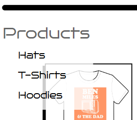
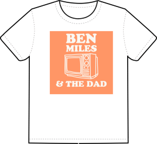

# Final Project: Merchandise Sales Site

Frontend Repository: [Frontend Repo](https://github.com/DavidMiles1925/fp-frontend).
Backend Repository: [Backend Repo](https://github.com/DavidMiles1925/fp-backend).

## Table Of Contents

**1 - Project Features**

**-- 1.1 -** Code Layout and Semantics  
-- 1.1.1 BEM Methodology  
-- 1.1.2 Naming Conventions

**-- 1.2 -** React App  
-- 1.2.1 Functional Components  
-- 1.2.2 Contexts

**-- 1.3 -** Notable Features  
-- 1.3.1 Embeded Content  
-- 1.3.2 Animations  
-- 1.3.3 Form Validation  
-- 1.3.4 Dropdown Menu  
-- 1.3.4 Chuck NorrisJoke Generator  
-- 1.3.5 Passing Images Through JSON  
-- 1.3.6 Responsive Design

**-- 1.4 -** Responsive Design  
-- 1.4.1 Flexbox  
-- 1.4.2 Grid Layout

**2 - Future Development Plans**

**-- 2.1 -** User Profile  
-- 2.1.1 Sales API  
-- 2.1.2 Order Tracker  
-- 2.1.3 Change Password

**-- 2.2 -** Physical Product Development  
-- 2.1.1 Clothing  
-- 2.1.1 Trinkets

**-- 2.3 -** Complete Documentation

**-- 2.4 -** Main Page Content

**3 - Documentation** - UNDER CONSTRUCTION  
**-- 3.1 -** Components  
-- 3.1.1 App  
-- 3.1.2 CardSection  
-- 3.1.3 CardViewModal  
-- 3.1.4 ContactInfo  
-- 3.1.5 CreatorInfo  
-- 3.1.6 DeveloperPanel  
-- 3.1.7 DividerCard  
-- 3.1.8 Footer  
-- 3.1.9 Header  
-- 3.1.10 JokeGenerator  
-- 3.1.11 LoginModal  
-- 3.1.12 Main  
-- 3.1.13 ModalWithForm  
-- 3.1.14 ProductCard  
-- 3.1.15 ProductsPage  
-- 3.1.16 ProductViewModal  
-- 3.1.17 ProtectedRoute  
-- 3.1.18 RegisterModal  
-- 3.1.19 ShoppingCart  
-- 3.1.20 SideBarMenu  
-- 3.1.21 StillBuilding  
-- 3.1.22 UserDropdownMenu  
-- 3.1.23 UserInformationPage  
-- 3.1.24 UserProfilePage  
-- 3.1.25 UserSidebarMenu  
-- 3.1.26 UserUpdateProfileModal

**-- 3.2 -** Contexts  
-- 3.2.1 CurrentUserContext  
-- 3.2.3 FilterContext  
-- 3.2.3 ValidationContext

**-- 3.3 -** Utils  
-- 3.3.1 api  
-- 3.3.2 auth  
-- 3.3.3 chuckNorrisApi  
-- 3.3.4 constants  
-- 3.3.5 useFormAndValidation

**-- 3.4 -** Dependencies

## 1 - Product Features

### 1.1 - Code Layout and Semantics

**-- 1.1.1** BEM Methodology

**-- 1.1.2** Naming Conventions

Strict naming conventions were used to ensure consistency and readability, as well as to help avoid naming conflicts.

-- All variables and functions (with the exception of functional components) are `camelCase` and always start with a letter. They always begin with a letter, the first word is a noun, and they are descriptive for easy readability.

-- All functional components start with a noun. All words begin with a capital letter. Abreviations capitalize only the first letter. yes: "Url" no: "URL"

-- All named constants are `UPPERCASE` with underscores separating words. This excludes menu populator data, which follow the naming conventions for variables.

### 1.2 - React App

**-- 1.2.1** Functional Components

React allows for functions to return elements of the DOM, making easy to pair form and functionality. All functional components for this project are located in the src/components directory, and are described is section _3.1_ of the readme file.

**-- 1.2.2** Contexts

One particularly useful feature of React is the `useContext()` hook. Contexts allow for easy passing of data throughout an entire tree of elements without the need for continually passing that data through every branch of the tree. The contexts used in this project are described in section _3.2_ of the readme file.

### 1.3 - Notable Features

**-- 1.3.1** Embeded Content

Since this project is dedicated to promoting a YouTube channel, it's only natural that videos would need to be embeded. Currently, the Main Page sports the latest video from the channel.

**-- 1.3.2** Animations

To enhance the user experience, as well as avoid confusion, All buttons and links are animated. They use a pointer cursor, as well as scale up 10% when hovering the cursor over them. They also respond by scaling down when clicked, except in a few special cases.

**-- 1.3.3** Form Validation

All forms are validated before sending requests to the server. A custom hook, `useFormAndValidation`, was used for single-line impletation in each form.

**-- 1.3.4** Dropdown Menu

Menus were created to be collapsible in order to support all screen sizes.

 

**-- 1.3.4** Chuck Norris Joke Generator

One reqirement of this project was to include the use of a third-part API. The creator of the YouTube channel loves Chuck Norris jokes, so we decided a joke generator would make a good addition to the main page.

**-- 1.3.5** Passing Images Through JSON

In future versions, an admin user will be able to create new products. Connecting an image by URL is not ideal for displaying custom photos, so a user will be able to select a photo from their local machine. In order to continue using JSON format, images will be converted to base64 strings. The app has been configured to display images in a method that is consistent with receiving base64 strings as image data. Some example strings have been included in the front end image folder.

**-- 1.3.6** Responsive Design

CSS tools `flexbox` and `grid` were used ensure seamless transitions between screen sizes. In some cases, media queries were used to tweak element properties to optimize aesthetics and functionality.

## 2 - Future Development Plans

### 2.1 User Profile

**-- 2.1.1** Sales API

In order for users to actually make purchases, a sales API will be used for completing financial transations.

**-- 2.1.2** Order Tracker

Customers have come to expect updates on the status of their order. An order tracker page will need to be created in order for the user to recall their order history.

**-- 2.1.3** Change/Forgot Password

In a world of a thousand passords, it is easy to forget what one might have used as a password for one's less frequented websites. A feature to allow users to change their password will be added in the future.

### 2.2 - Physical Product Development

**-- 2.1.1** Clothing

The example items currently featured on the site are all clothing products. These will be relatively cheap and easy to obtain when our YouTube creator is really ready to take off. Shirts, hats, hoodies, etc.

**-- 2.1.2** Trinkets

Things like bumper stickers and key chains could be options in the distant future for sales and brand promotion.

### 2.3 - Complete Documentation

**-- 2.1.1** Developer Documentation (in progress, see below _section 3_)

This is currently only a small side project. Later on, if this endevour is scaled up, it will be important for myself (or potentially other developers) to have notes about the code.

**-- 2.1.1** User Documentation

This will include an FAQ for users to explore, as well as some helpful tips for navigating the website and order process as easily as possible.

### 2.4 - Main Page Content

Currently the main page is lacking in rich content. The creation of more videos, as well as time spent growing the brand will allow for the creation of better and more abundant content.

## 3 - Documentation - UNDER CONSTRUCTION

### 3.1 - Components

**-- 3.1.1 `App`**

-- -- Variables

-- -- 3.1.1.1 `isAdmin` - `true` if user has admin privilages (furture development)

-- -- 3.1.1.2 `isDevMode` -bool- Set to `true` to enable _3.1.6_ `DeveloperPanel`.

-- -- 3.1.1.3 `isLoading`  
-bool-  
Is set to `true` during asynchronous requests.

-- -- 3.1.1.4 `isLoggedIn`  
-bool-  
 Is set to `true` when the user logs in.

-- -- 3.1.1.5 `activeCard`  
-object-  
The data to populate _3.1.16_ `ProductViewModal`.

-- -- 3.1.1.6 `activeMenuSelection`  
-object-  
`setActiveMenuSelection` sets the active menu item for _3.1.20_ `SideBarMenu`, _3.1.22_ `UserDropdownMenu`, _3.1.25_`UserSidebarMenu`.

-- -- 3.1.1.7 `activeModal`  
-string-  
`setActiveModal` sets the open modal window.

-- -- 3.1.1.8 `alternateAvatar`  
-string-  
Is set by `setAlternateAvatar(`_3.1.1.19_`getUserFirstLetter(`_3.1.1.10_`currentUser))` to be the first letter of the user's name.

-- -- 3.1.1.9 `chuckJoke`  
-string-
Random Chuck Norris joke populate by \*\*`getJoke`

-- -- 3.1.1.10 `currentUser`  
-object-  
-keys: -

-- -- 3.1.1.11 `disableButton`
-bool-

-- -- 3.1.1.12 `errorDisplay`  
-object-  
-keys: value(bool), string-

-- -- 3.1.1.13 `productList`  
-object-  
-keys:-  
Holds the list of products do be displayed on the _3.1.15_ `ProductsPage`.

-- -- Fuctions

-- -- 3.1.1.14 `adjustCartTotalForPriceChanges`  
-- -- 3.1.1.15 `closeActiveModal`  
-- -- 3.1.1.16 `closeModal`  
-- -- 3.1.1.17 `convertToFloat`  
-- -- 3.1.1.18 `generateJoke`  
-- -- 3.1.1.19 `getUserFirstLetter`  
-- -- 3.1.1.20 `handleAddToCart`  
-- -- 3.1.1.21 `handleCardClick`  
-- -- 3.1.1.22 `handleLoginSubmit`  
-- -- 3.1.1.23 `handleLogOut`  
-- -- 3.1.1.24 `handleUpdateClick`  
-- -- 3.1.1.25 `handleUpdateSubmit`  
-- -- 3.1.1.26 `handleRemoveFromCart`  
-- -- 3.1.1.27 `handleSignUpSubmit`  
-- -- 3.1.1.28 `handleToggleAdmin`  
-- -- 3.1.1.29 `handleToggleLogin`  
-- -- 3.1.1.30 `selectLogin`  
-- -- 3.1.1.31 `selectSignUp`  
-- -- 3.1.1.32 `handleModalErrorDislay`  
**-- 3.1.2 `CardSection`**  
**-- 3.1.3 `CardViewModal`**  
**-- 3.1.4 `ContactInfo`**  
**-- 3.1.5 `CreatorInfo`**  
**-- 3.1.6 `DeveloperPanel`**  
**-- 3.1.7 `DividerCard`**  
**-- 3.1.8 `Footer`**  
**-- 3.1.9 `Header`**  
**-- 3.1.10 `JokeGenerator`**  
**-- 3.1.11 `LoginModal`**  
**-- 3.1.12 `Main`**  
**-- 3.1.13 `ModalWithForm`**  
**-- 3.1.14 `ProductCard`**  
**-- 3.1.15 `ProductsPage`**  
**-- 3.1.16 `ProductViewModal`**  
**-- 3.1.17 `ProtectedRoute`**  
**-- 3.1.18 `RegisterModal`**  
-- -- 3.1.1.2.2 `handlePhoneChange`  
-- -- 3.1.1.2.2 `handleSubmit`  
**-- 3.1.19 `ShoppingCart`**  
**-- 3.1.20 `SideBarMenu`**  
-- -- 3.1.1.2 `handleCategoryClick`  
-- -- 3.1.1.2 `handleResize`  
-- -- 3.1.1.2 `handleTopClick`  
-- -- 3.1.1.2 `toggleDropdown`  
**-- 3.1.21 `StillBuilding`**  
**-- 3.1.22 `UserDropdownMenu`**  
-- -- 3.1.22.1 `isOpen`  
-- -- 3.1.22.2 `handleLinkClick`  
-- -- 3.1.22.3 `handleTopClick`  
-- -- 3.1.22.4 `toggleDropdown`  
**-- 3.1.23 `UserInformationPage`**  
-- -- 3.1.23.1 `formattedPhoneNumber`  
-- -- 3.1.23.2 `formatPhoneNumber`  
**-- 3.1.24 `UserProfilePage`**  
**-- 3.1.25 `UserSidebarMenu`**  
-- -- 3.1.25.1 `formattedPhoneNumber`  
-- -- 3.1.25.2 `handleMenuClick`  
-- -- 3.1.25.3 `handleResize`  
-- -- 3.1.25.4 `handleTopClick`  
-- -- 3.1.25.5 `toggleDropdown`  
**-- 3.1.26 `UserUpdateProfileModal`**  
-- -- 3.1.26.1 `formatPhoneNumber`  
-- -- 3.1.26.2 `handlePhoneChange`  
-- -- 3.1.26.3 `handleSubmit`

### 3.2 - Contexts

**-- 3.2.1** `CurrentUserContext`  
**-- 3.2.3** `FilterContext`  
**-- 3.2.3** `ValidationContext`

### 3.3 - Utils

**-- 3.3.1** `api`  
-- -- 3.3.1.1 `createProduct`  
-- -- 3.3.1.2 `deleteProduct`  
-- -- 3.3.1.3 `getProducts`  
-- -- 3.3.1.4 `processServerReponse`  
-- -- 3.3.1.5 `request`  
**-- 3.3.2 `auth`**  
-- -- 3.3.2.1 `addToCart`  
-- -- 3.3.2.2 `checkToken`  
-- -- 3.3.2.3 `removeFromCart`  
-- -- 3.3.2.4 `signin`  
-- -- 3.3.2.5 `signup`  
-- -- 3.3.2.6 `updateCartTotal`  
-- -- 3.3.2.7 `updateUser`  
**-- 3.3.3 `chuckNorrisApi`**  
-- -- 3.3.3.1 `getJoke`  
**-- 3.3.4 `constants`**  
-- -- 3.3.4.1 `Text Constants`  
-- -- 3.3.4.2 `Dropdown Menus`  
**-- 3.3.5 `useFormAndValidation`**  
-- -- 3.3.5.1 `values`  
-- -- 3.3.5.2 `errors`  
-- -- 3.3.5.3 `isValid`  
-- -- 3.3.5.4 `handleChange`  
-- -- 3.3.5.5 `resetForm`
